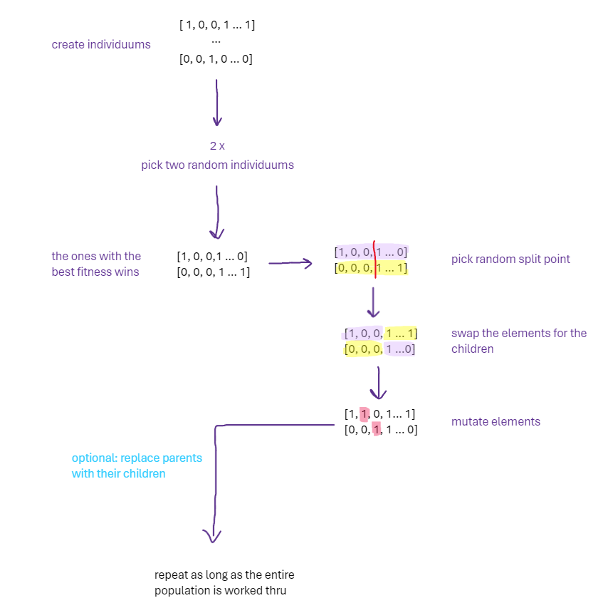

# Description
### This genetic Algorithm can "solve" the following problem
We have a shipping container with a maximum load of 26.630 KG. We also have 500 Packets, each with a weight (in KG) and a price.
What we want is to fit as many packets as possible into the container, maximizing the value (sum of prices) of the packets.

